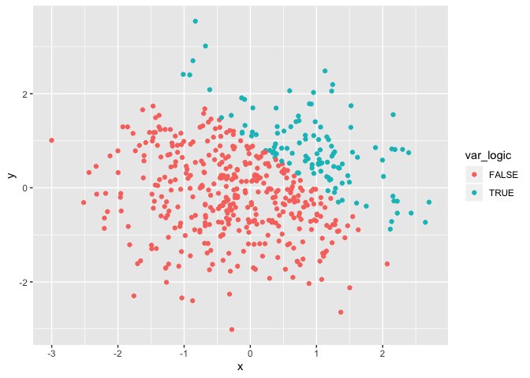
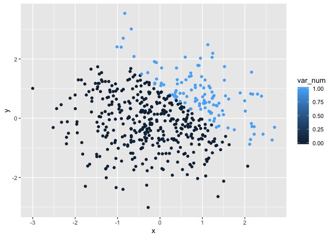
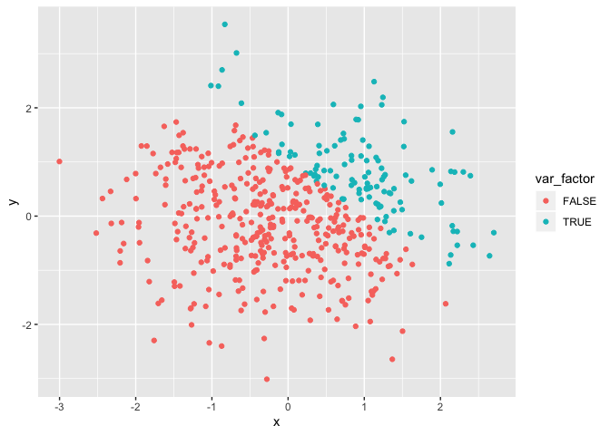

HW 1
================
Xing Chen
2019-9-19

# **Problem 1**

## create a data frame containing 4 variables

``` r
set.seed(1)

problem1_df = tibble(
  sample = rnorm(8),
  sample_logic = sample > 0,
  sample_char = c("hellow", "world", "this", "this", "is", "a","test", "!"),
  sample_factor = factor(c("apple", "banana", "grape", "banana", "grape",
                           "apple", "grape", "apple"))
)

mean(pull(problem1_df, sample))
```

    ## [1] 0.1314544

``` r
mean(pull(problem1_df, sample_logic))
```

    ## [1] 0.625

``` r
mean(pull(problem1_df, sample_char))
```

    ## Warning in mean.default(pull(problem1_df, sample_char)): argument is not
    ## numeric or logical: returning NA

    ## [1] NA

``` r
mean(pull(problem1_df, sample_factor))
```

    ## Warning in mean.default(pull(problem1_df, sample_factor)): argument is not
    ## numeric or logical: returning NA

    ## [1] NA

The mean value of variable sample and sample\_logic can be calculated
becuase the value stored in these 2 variables are numbers.

The mean value for variable sample\_logic and sample\_char cannot be
calculated because the value stored in these 2 variables are string.

## coerce the variables to numeric

``` r
as.numeric(pull(problem1_df, sample_logic))

as.numeric(pull(problem1_df, sample_char))
```

    ## Warning: NAs introduced by coercion

``` r
as.numeric(pull(problem1_df, sample_factor))
```

The logical vector is successful coerced to numeric because within R,
the value “TRUE” is stored as 1 and value “FALSE” is stored as 0 and
therefore it can be converted into numeric form.

The character vector is not successfully coerced to numeric because a
string cannot be converted into numeric form.

The factor vector is successfully coerced to numeric eventhough the
value in this vector is string. This is because the level concept in
factor. The level of each value is shown when “as.numeric” is applied to
a factor vector.

I think this partly expalin what happens when I take the mean of each
vaector. The one that can be succeffully coerced by “as.numeric” can be
applied to a mean calculation. However, a factor can be coerced by
“as.numeric” but still cannot be applied to a mean
    calculation.

## coerce the variables into different classes

``` r
as.numeric(pull(problem1_df, sample_logic)) * pull(problem1_df, sample)
```

    ## [1] 0.0000000 0.1836433 0.0000000 1.5952808 0.3295078 0.0000000 0.4874291
    ## [8] 0.7383247

``` r
as.factor(pull(problem1_df, sample_logic)) * pull(problem1_df, sample)
```

    ## Warning in Ops.factor(as.factor(pull(problem1_df, sample_logic)),
    ## pull(problem1_df, : '*' not meaningful for factors

    ## [1] NA NA NA NA NA NA NA NA

``` r
as.numeric(as.factor(pull(problem1_df, sample_logic))) * pull(problem1_df, sample)
```

    ## [1] -0.6264538  0.3672866 -0.8356286  3.1905616  0.6590155 -0.8204684
    ## [7]  0.9748581  1.4766494

# Problem 2

# create a dataframe with 5 variables

``` r
set.seed(10)

problem2_df = tibble(
  x = rnorm(500),
  y = rnorm(500),
  var_logic = x + y > 1,
  var_num = as.numeric(var_logic),
  var_factor = as.factor(var_logic)
)
```

The data frame problem2\_df has 500 rows and 5 columns. The mean value
of x is -0.0108732, the median value of x is -0.0212291, and the
standard deviation of x is 1.0164129. The proportion for `x + y > 1` is
0.228

## plot 3 scatterplots for variables x and y, colored by different variables

``` r
ggplot(problem2_df, aes(x = x, y = y, color = var_logic)) + geom_point()
```

<!-- -->

``` r
ggplot(problem2_df, aes(x = x, y = y, color = var_num)) + geom_point()
```

<!-- -->

``` r
ggplot(problem2_df, aes(x = x, y = y, color = var_factor)) + geom_point()
```

<!-- -->

## comment on color scale

When the plot is colored by logical vector, two colors are created for
the value “TURE” and“FALSE”.

When the plot is colored by numeric variable, a series of colors, ranged
from light to dark, are created. But this numeric variable is converted
from a logical variable. Thus only two values exist in it and the dots
are only in 2 colors.

When the plot is colored by factor variable, the number of colors are
created depending on the level of factor variable. Because this factor
variable is converted from a logical variable, only 2 levels exist in it
and the dots in the scatter plot are in 2
colors.

## output the first plot

``` r
ggsave("scatter_plot.pdf", plot = ggplot(problem2_df, aes(x = x, y = y, color = var_logic)) + geom_point())
```

    ## Saving 7 x 5 in image
